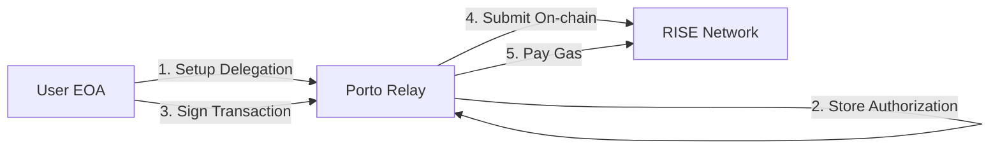

# RISE Porto Relay - React Native Example

A minimal React Native example demonstrating gasless transactions on RISE testnet using Porto Protocol relay.

## 🎯 What is Porto?

Porto is a meta-transaction relay that enables **gasless transactions** on RISE network. Users can interact with smart contracts without holding ETH for gas fees - Porto sponsors the gas costs.

### Key Features:
- **Zero gas fees** for users
- **EIP-7702 delegation** for account abstraction  
- **Simple integration** - just call relay APIs
- **Fresh EOA support** - works with brand new wallets

## 🏗️ How It Works



1. **Generate Wallet** - Create a fresh EOA (0 ETH balance)
2. **Setup Delegation** - Authorize Porto proxy via EIP-7702
3. **Sign Transaction** - User signs with their private key
4. **Porto Executes** - Relay submits and pays gas
5. **Transaction Complete** - User maintains 0 ETH balance

## 🚀 Quick Start

### Prerequisites
- Node.js 18+
- iOS Simulator or Android Emulator
- Expo CLI (`npm install -g expo-cli`)

### Installation

```bash
# Clone the repository
git clone https://github.com/your-org/rise-porto-example.git
cd rise-porto-example

# Install dependencies
npm install

# Install iOS dependencies (iOS only)
cd ios && pod install && cd ..
```

### Running the App

```bash
# Start Metro bundler
npm start

# Run on iOS
npm run ios

# Run on Android
npm run android
```

### Running Tests

```bash
# Test the complete gasless flow
cd tests
node test-complete-flow.mjs
```

## 📁 Project Structure

```
rise-porto-example/
├── src/
│   ├── lib/
│   │   └── simple-porto.ts      # Porto relay functions (150 lines)
│   ├── screens/
│   │   └── ExampleScreen.tsx    # Demo UI showing full flow
│   ├── config/
│   │   └── constants.ts         # Network & contract addresses
│   └── abi/
│       └── FrenPetSimple.json   # Example contract ABI
├── tests/
│   └── test-complete-flow.mjs   # Node.js test demonstrating flow
├── App.tsx                      # Simple single-screen app
└── README.md                    # This file
```

## 🔧 Core Functions

The `simple-porto.ts` module provides direct mappings to Porto relay APIs:

```typescript
// Check relay health
await checkHealth()

// Setup delegation for gasless transactions
const prepareResponse = await prepareUpgradeAccount(account)
await upgradeAccount(account, prepareResponse)

// Send a gasless transaction
const result = await sendTransaction(
  account,           // User's EOA
  contractAddress,   // Target contract
  calldata,         // Encoded function call
  value            // ETH value (usually '0x0')
)
```

## 💡 Usage Example

```typescript
import { generateAccount, sendTransaction } from './lib/simple-porto';
import { encodeFunctionData } from 'viem';

// 1. Generate a fresh wallet (0 ETH)
const account = generateAccount();

// 2. Encode your contract call
const calldata = encodeFunctionData({
  abi: contractABI,
  functionName: 'createPet',
  args: ['Fluffy']
});

// 3. Send gasless transaction
const result = await sendTransaction(
  account,
  '0x3FDE139A94eEf14C4eBa229FDC80A54f7F5Fbf25', // FrenPet contract
  calldata,
  '0x0' // No ETH value
);

console.log('Transaction sent!', result.bundleId);
// User still has 0 ETH - Porto paid the gas!
```

## ⚙️ Configuration

```typescript
// src/config/constants.ts
export const PORTO_CONFIG = {
  relayUrl: 'https://rise-testnet-porto.fly.dev',
  chainId: 11155931,
  contracts: {
    proxy: '0xf463d5cbc64916caa2775a8e9b264f8c35f4b8a4',
    orchestrator: '0x046832405512D508b873E65174E51613291083bC',
    frenPetSimple: '0x3FDE139A94eEf14C4eBa229FDC80A54f7F5Fbf25'
  }
};
```

## 🧪 Test Output

Running `node test-complete-flow.mjs` demonstrates the full gasless flow:

```
🚀 COMPLETE GASLESS FLOW TEST
============================================================
Account: 0x63F3C4f744E14886729D2D84AFbFd8f1C3482BE6
Initial Balance: 0 wei

1️⃣ Setting up delegation...
   ✅ Delegation stored in relay

2️⃣ Preparing transaction...
   ✅ Calls prepared
   📦 Will deploy delegation + execute transaction

3️⃣ Signing and sending transaction...
   ✅ Transaction sent!
   Bundle ID: 0x39719ec8...

4️⃣ Waiting for confirmation...
   Status: 200
   Receipt status: ✅ Success

5️⃣ Verifying results...
   Final balance: 0 wei
   Gasless achieved: ✅ Yes
   Delegation deployed: ✅ Yes
   Pet created: ✅ Yes

✅ SUCCESS! Gasless flow working perfectly!
   • Started with fresh EOA (0 ETH)
   • All gas sponsored by Porto relay
```

## 📚 Key Concepts

### EIP-7702 Delegation
Porto uses EIP-7702 to deploy a minimal proxy that delegates execution to Porto's orchestrator contract. This happens transparently on the first transaction.

### Gasless Transactions
Users sign transactions offline. Porto relay submits them on-chain and pays the gas. The user never needs ETH.

### Contract Whitelisting
Porto relay only sponsors transactions to whitelisted contracts. The FrenPet example contract (`0x3FDE139A94eEf14C4eBa229FDC80A54f7F5Fbf25`) is pre-whitelisted.

## 🔗 Resources

- **RISE Testnet Explorer**: https://explorer.testnet.riselabs.xyz
- **Porto Documentation**: https://porto.sh
- **RISE Faucet**: https://faucet.riselabs.xyz (not needed for gasless!)

## ⚠️ Important Notes

1. **Contract addresses must be checksummed** (uppercase/lowercase) for relay whitelisting
2. Porto relay is currently on RISE testnet (chainId: 11155931)
3. This is a simplified example - production apps should add error handling and user feedback

## 📄 License

MIT - Use freely in your projects!

## 🤝 Contributing

This is an example repository. For Porto protocol improvements, please contribute to the main Porto repository.

---

Built with ❤️ for the RISE ecosystem